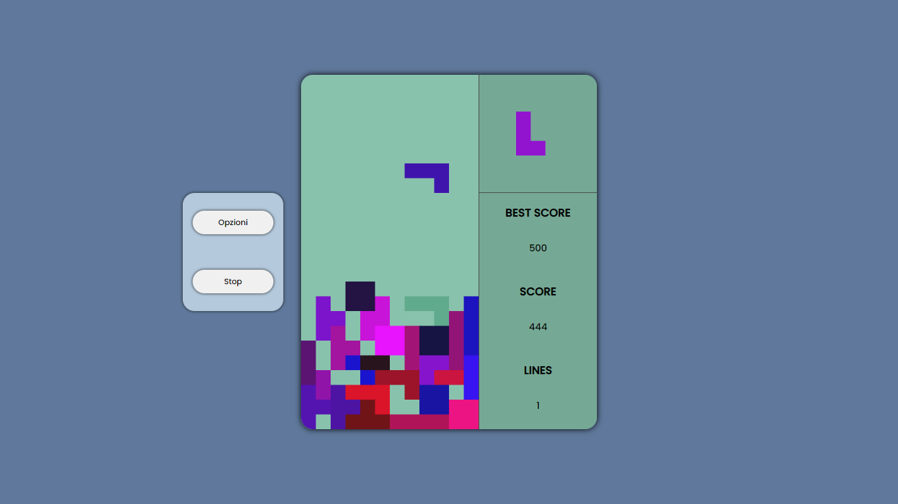

# Tetris in Javascript

- tetris written in Javascript
- there is the possibility to change the screen size at will
- the peculiarity of the algorithm is that the blocks can be created at will and the rotation algorithm will work on all the blocks created



# The creation of the blocks

- The blocks are declared in the switch of the RandomBlock function, with instances of the Block class, in which the constructor accepts as parameters the length and height of the block and an array containing the pattern of the block: 

```
RandomBlock(){
    switch (Math.floor(Math.random() * 5) + 1) {
        case 1: return new Block(4, 4, [1,1,1,1,0,0,0,0,0,0,0,0,0,0,0,0,0,0,0,0])
        case 2: return new Block(2, 2, [1,1,1,1])
        case 3: return new Block(3, 3, [1,0,0,1,0,0,1,1,0])
        case 4: return new Block(3, 3, [1,0,0,1,1,0,0,1,0])
        case 5: return new Block(3, 3, [1,1,1,0,1,0,0,0,0])
    }	
}

```


